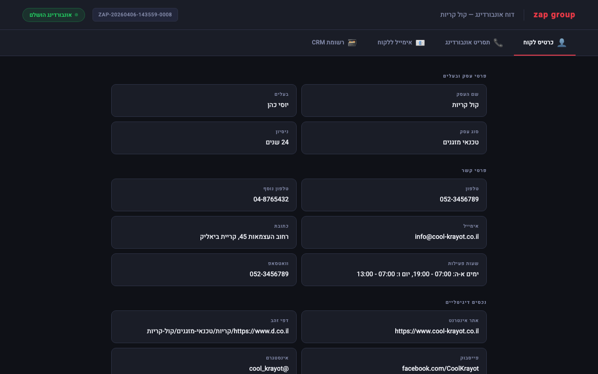
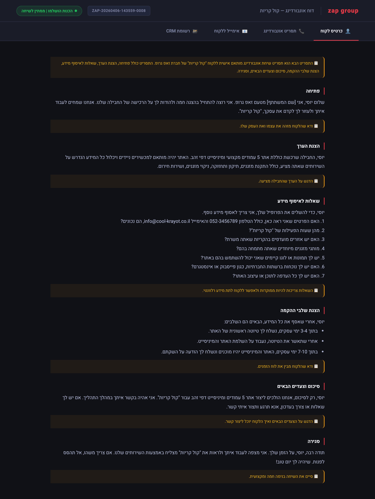
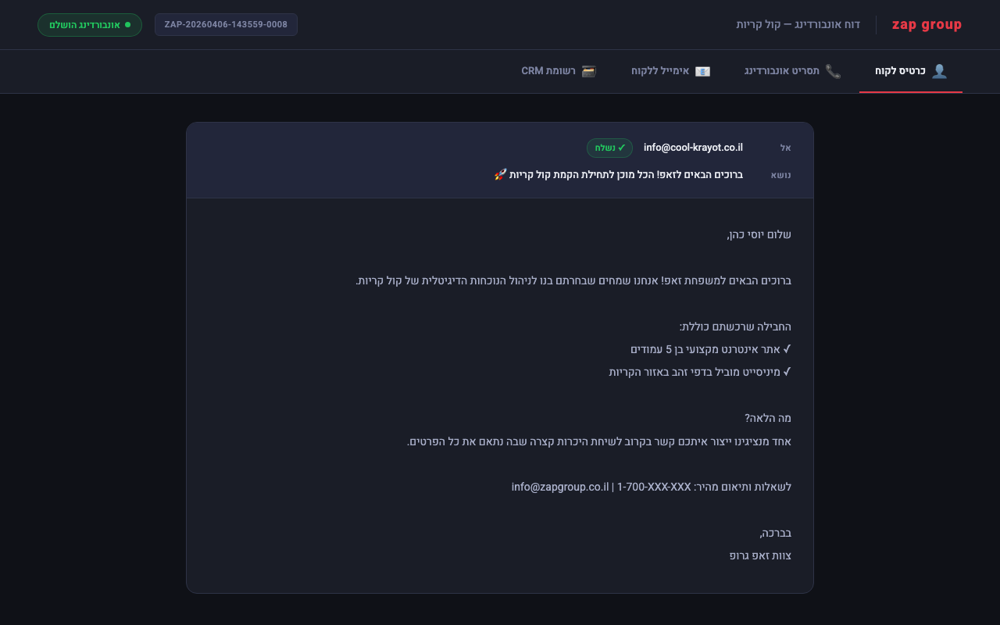
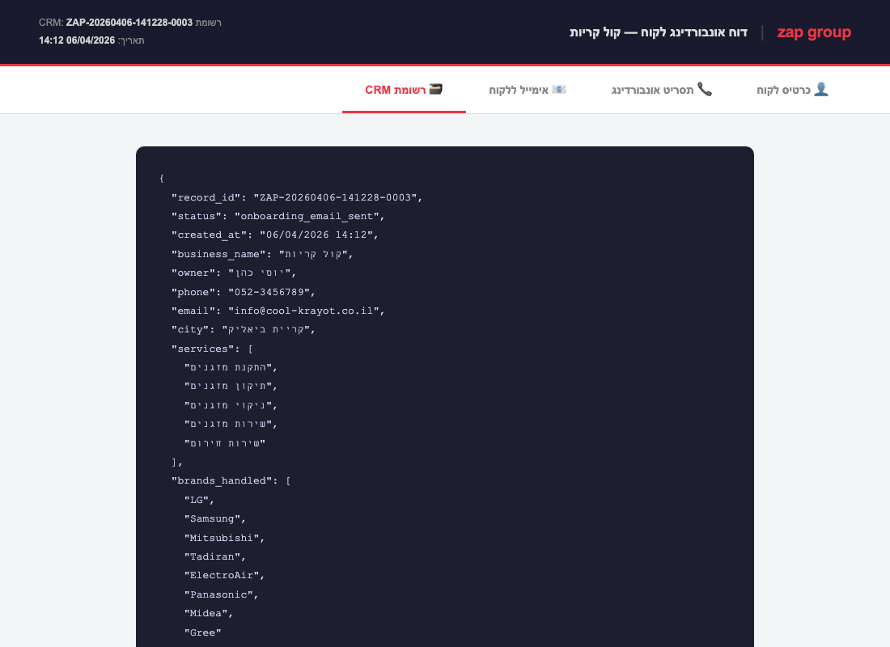

# Zap Group – AI Onboarding Automation

פתרון שבניתי למשימת הבית של זאפ גרופ — אוטומציה שסורקת את הנכסים הדיגיטליים של לקוח חדש, שולפת ממנו מידע, ומייצרת ממנו כרטיס לקוח, תסריט שיחה, ורישום CRM — הכל אוטומטי.

**לקוח לדוגמה:** טכנאי מזגנים באזור הקריות — אתר 5 עמודים + מיניסייט בדפי זהב.

---

## איך זה עובד

```
         אתר הלקוח + דפי זהב
                  │
                  ▼
           ┌─────────────┐
           │  Web Scraper │
           │ requests /   │
           │  Playwright  │
           └──────┬───────┘
                  │
                  ▼
        ┌──────────────────────┐
        │    AI Extraction     │
        │  Groq llama-3.3-70b  │
        │ פרטי קשר, שירותים,  │
        │  מותגים, אזורי פעילות│
        └────────┬─────────────┘
                 │
        ┌────────┴────────┐
        ▼                 ▼
  ┌───────────┐    ┌──────────────┐
  │ כרטיס לקוח│    │תסריט אונבורדינג│
  │ למפיק זאפ │    │  מותאם אישית  │
  └─────┬─────┘    └──────┬───────┘
        └────────┬─────────┘
                 │
                 ▼
        ┌─────────────────┐
        │   CRM + אימייל  │
        │ רישום + שליחה   │
        └────────┬────────┘
                 │
                 ▼
        ┌─────────────────┐
        │  דף תוצאות HTML │
        │ נפתח בדפדפן     │
        └─────────────────┘
```

---

## התקנה והרצה

```bash
pip install -r requirements.txt
python -m playwright install chromium
```

מפתח Groq חינמי (ללא כרטיס אשראי) מ-[console.groq.com](https://console.groq.com):

```bash
echo 'GROQ_API_KEY=your-key-here' > .env
```

### Demo mode

```bash
python main.py --demo
```

### Live mode

```bash
python main.py --website https://example-client.co.il --dapei-zahav "https://www.d.co.il/..."
```

---

## פלטים

כל הקבצים נשמרים ב-`output/`:

| קובץ | תוכן |
|------|------|
| `client_data.json` | נתוני הלקוח המובנים |
| `client_card.md` | כרטיס הלקוח למפיק |
| `onboarding_script.md` | תסריט שיחת האונבורדינג |
| `email_*.txt` | האימייל שנשלח ללקוח |

---

## מגבלות ידועות

- **Groq free tier** — מגביל 100k טוקנים ליום. אם נגמר המכסה, מחכים עד למחרת.
- **דפי זהב** — חוסמת scrapers (403/429). ה-demo mode משתמש בנתוני mock ריאליסטיים.
- **שליחת מייל** — עכשיו מסומלצת (נשמרת לקובץ). לחיבור אמיתי ראה הוראות ב-`src/crm.py`.

---

## חיבור מייל אמיתי

הפונקציה `simulate_send_email` ב-`src/crm.py` מכילה הוראות מפורטות לחיבור:
- SendGrid (`pip install sendgrid`)
- SMTP רגיל (Gmail / Outlook)
- Mailchimp Transactional

---

## מבנה הפרויקט

```
├── main.py                 # זרימת העבודה הראשית
├── requirements.txt
├── src/
│   ├── scraper.py          # סריקת אתרים + Playwright fallback
│   ├── ai_processor.py     # חילוץ נתונים + יצירת כרטיס ותסריט
│   ├── crm.py              # רישום CRM + סימולציית אימייל
│   └── results_viewer.py   # דף HTML לתצוגת תוצאות
├── data/
│   └── demo_data.py        # נתוני demo של טכנאי מזגנים
└── screenshots/
```

---

## דוגמת פלט

### כרטיס לקוח


### תסריט שיחת אונבורדינג


### אימייל ללקוח


### רשומת CRM


---

*Or Dahan*
